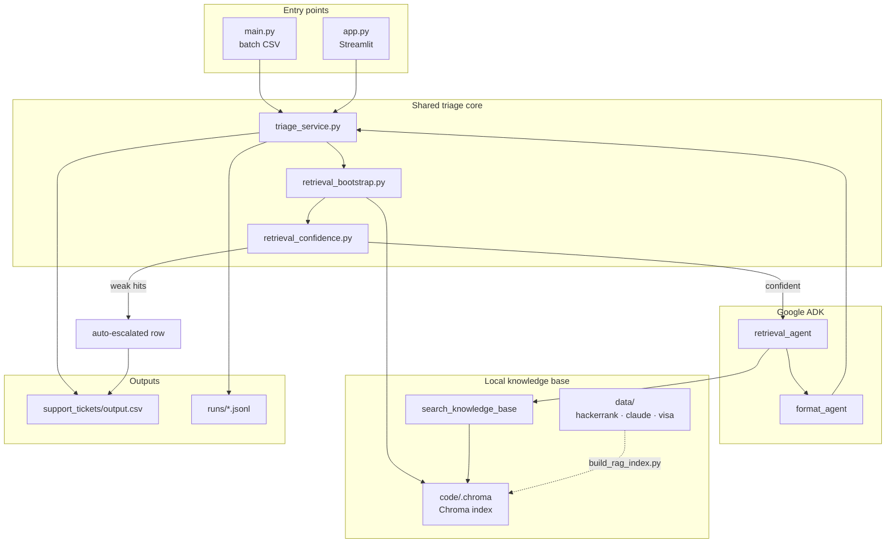
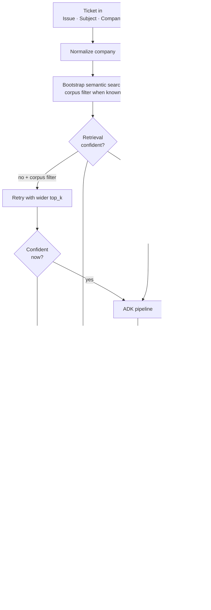

# Support ticket triage agent

A production-style **batch triage system** that ingests customer support tickets from CSV, grounds answers in an internal help-center corpus (HackerRank, Claude, and Visa content shipped with the repo), and emits **structured, reviewable predictions**—status, product area, customer-facing reply, justification, and request type—so operations teams can automate first-line handling without inventing policy.

**Origin:** Submitted as my entry to **HackerRank Orchestrate** (May 2026), a timed build around real-world agentic support workflows. Contest rules, schemas, and evaluation are in [`problem_statement.md`](problem_statement.md) and [`evalutation_criteria.md`](evalutation_criteria.md).

## What this product does

- **Deterministic batch pipeline** — one row in, one grounded prediction out; writes to `support_tickets/output.csv`.
- **Corpus-bound answers** — retrieval over local markdown in `data/` via Chroma + embeddings; no live web as a source of truth for responses (per challenge constraints).
- **Retrieval confidence gate** — bootstrap search runs before the agent; Chroma distance thresholds in `config.py` auto-escalate tickets with weak or off-topic hits so the model never replies without evidence.
- **Agent orchestration** — Google ADK sequential flow (`gemini-2.5-flash`: retrieve, then structured format) with Pydantic output; shared `triage_service` powers both CLI and Streamlit UI (see [`code/README.md`](code/README.md)).
- **Ops-ready configuration** — secrets via environment variables; optional repo-root `.env` loaded by `main.py` and `app.py` (`python-dotenv`).

## Stack

Python 3.11+, **Google ADK** (`gemini-2.5-flash`), **Chroma**, **sentence-transformers** / EmbeddingGemma, **Streamlit** (operator UI). Details and model IDs in [`code/README.md`](code/README.md).

## Architecture



## Workflow

Per-ticket path (same for CLI batch and Streamlit):



## Documentation

| Doc | What it covers |
| --- | --- |
| [`code/README.md`](code/README.md) | Architecture, install, RAG index build, `main.py`, `app.py`, troubleshooting |
| [`problem_statement.md`](problem_statement.md) | Task spec, I/O schema, constraints, submission context |
| [`evalutation_criteria.md`](evalutation_criteria.md) | Scoring rubric |

## Quickstart

Run from the **repository root** so `data/`, `support_tickets/`, and `code/.chroma` resolve correctly.

```bash
pip install -e .
cp .env.example .env   # add GOOGLE_API_KEY
python scripts/build_rag_index.py
```

**Web UI (for operators):** submit one ticket or upload a CSV without using the command line.

```bash
streamlit run code/app.py
```

**Batch CLI (for automation):**

```bash
python code/main.py
```

- **Input:** `support_tickets/support_tickets.csv` (for labeled regression rows, point `input_csv` in `main.py` at `sample_support_tickets.csv` — see [`code/README.md`](code/README.md)).
- **Output:** `support_tickets/output.csv`.
- **Telemetry:** per-run JSONL logs in `runs/` (gitignored) with retrieval confidence, gate action, and latency per ticket.

**Tests:**

```bash
pytest
```

## Repository layout

```
.
├── .env.example                    # Env var template (copy to .env)
├── problem_statement.md            # Challenge spec and I/O schema
├── README.md                       # Product overview (this file)
├── pyproject.toml                  # Dependencies + package config
├── scripts/
│   ├── build_rag_index.py          # Build Chroma index from data/
│   └── get_col_count.py            # Debug: print chunk count
├── code/                           # Implementation (see code/README.md)
│   ├── README.md                   # Engineering deep-dive
│   ├── app.py                      # Streamlit UI for operators
│   ├── main.py                     # Batch entry point
│   ├── config.py                   # RAG tunables + confidence gate thresholds
│   ├── paths.py                    # Repo-root path constants
│   ├── runner_bootstrap.py         # Shared ADK Runner + session service
│   ├── agent_triager/
│   │   ├── agent.py                # Sequential retrieve → format agents
│   │   ├── triage_service.py       # Shared triage orchestration (CLI + UI)
│   │   ├── retrieval_bootstrap.py  # Pre-agent semantic search + company normalization
│   │   ├── retrieval_confidence.py # Distance-based confidence gate
│   │   ├── schema/                 # Pydantic input/output models
│   │   ├── tools/                  # ADK retrieval tool
│   │   └── rag/                    # Chunking, embeddings, Chroma
│   └── test/                       # Pytest: confidence gate + triage service
├── data/                           # Local help-center corpus
│   ├── hackerrank/
│   ├── claude/
│   └── visa/
├── runs/                           # Batch telemetry JSONL (gitignored)
└── support_tickets/
    ├── sample_support_tickets.csv  # Labeled examples
    ├── support_tickets.csv         # Challenge inputs
    ├── results/                    # Golden sample output
    └── output.csv                  # Agent predictions (gitignored)
```
