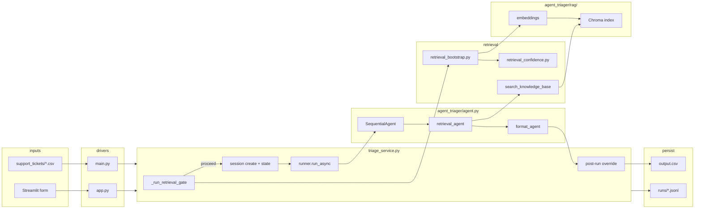
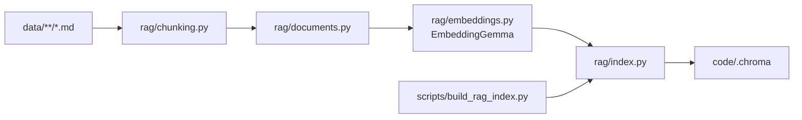
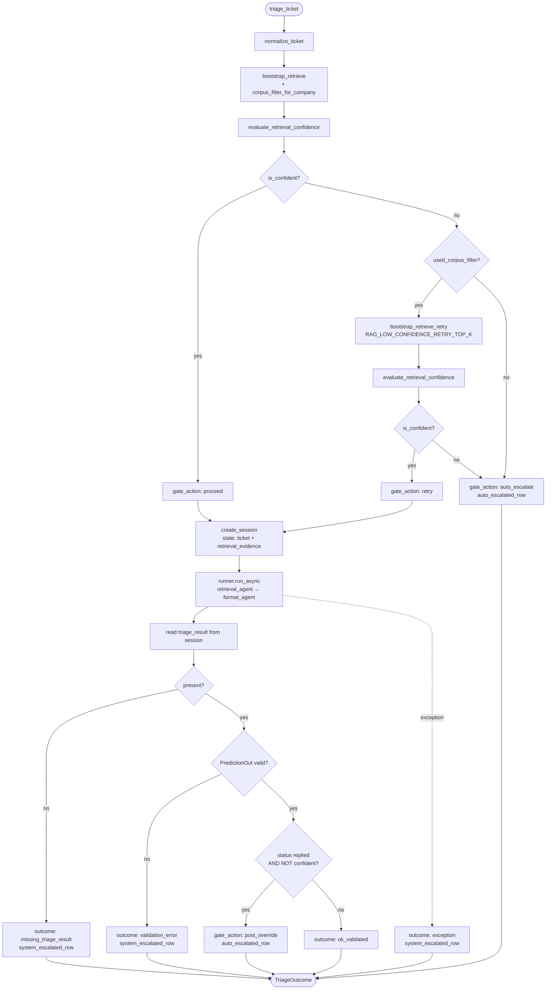

# Support ticket triager (Google ADK)

Terminal batch agent and Streamlit UI for **HackerRank Orchestrate**. Both paths read tickets (CSV batch or single form), run a **bootstrap retrieve → confidence gate → ADK retrieve → format** pipeline per row, and emit structured predictions.

## Architecture

| Layer | What it does |
| ----- | -------------- |
| **Bootstrap retrieval** | `retrieval_bootstrap.py` runs semantic search before the agent, normalizes company names, optionally filters by corpus (`hackerrank` / `claude` / `visa`), and seeds session state as `retrieval_evidence`. |
| **Confidence gate** | `retrieval_confidence.py` scores Chroma cosine distances against thresholds in `config.py`. Weak hits → auto-escalate without calling the LLM; strong hits → proceed. Retries with wider `top_k` when corpus filter was used. Post-run override blocks `status: replied` if evidence is still weak. |
| **Orchestration** | `SequentialAgent` in `agent_triager/agent.py`: `retrieval_agent`, then `format_agent`. |
| **Models** | Both steps use `gemini-2.5-flash`. Configure Google GenAI / ADK auth in your environment (see [Environment](#environment)). |
| **Retrieval tool** | `search_knowledge_base` runs semantic search over a **local** Chroma store built from the repo `data/` markdown corpus (`sentence-transformers`; model name in `config.py`). |
| **Shared triage** | `triage_service.py` is the single entry point for `main.py` (batch) and `app.py` (Streamlit). Handles gating, sessions, validation, fallbacks, and telemetry fields. |
| **Output** | `format_agent` emits structured `PredictionOut` (Pydantic), stored in session state as `triage_result`. |

### Component diagram



### Index build (one-time / on corpus change)



### Per-ticket workflow (`triage_ticket`)



Gate thresholds live in `config.py`: `RAG_MIN_HITS`, `RAG_MAX_BEST_DISTANCE`, `RAG_MAX_MEAN_TOP3_DISTANCE`.

## Project layout

| Path | Role |
| ---- | ---- |
| `main.py` | Batch driver: CSV in/out, calls `triage_ticket`, writes telemetry JSONL. |
| `app.py` | Streamlit UI: single-ticket form or CSV upload; same `triage_ticket` path. |
| `runner_bootstrap.py` | Shared ADK `Runner` and `session_service` for batch + UI. |
| `paths.py` | Repo-root paths: input/output CSV, runs dir, `.env`. |
| `config.py` | RAG chunk sizes, embedding model id, Chroma collection name, confidence gate thresholds. |
| `agent_triager/triage_service.py` | Core orchestration: gate, session, agent run, validation, escalated fallbacks. |
| `agent_triager/retrieval_bootstrap.py` | Pre-agent retrieval, company normalization, corpus filter. |
| `agent_triager/retrieval_confidence.py` | Distance-based confidence evaluation. |
| `agent_triager/agent.py` | Root sequential agent and instructions. |
| `agent_triager/schema/` | `SupportTicketInput`, `PredictionOut`, enums. |
| `agent_triager/tools/search_knowledge_base.py` | ADK retrieval tool (only wired tool). |
| `agent_triager/rag/` | Chunking, embeddings, Chroma build/query, hit formatting. |
| `test/` | Pytest coverage for confidence gate and triage service behavior. |
| `../scripts/build_rag_index.py` | One-shot CLI to build or refresh the vector index. |
| `../scripts/get_col_count.py` | Debug helper: print Chroma chunk count. |

## Environment

- **Secrets:** Use environment variables only; never commit API keys. Copy `.env.example` to `.env` at repo root. `main.py` and `app.py` load it via `python-dotenv`.
- **Gemini / ADK:** Set credentials the way your ADK install expects (often `GOOGLE_API_KEY` for the Gemini API). Consult the current [ADK](https://google.github.io/adk-docs/) and Google AI Studio docs if calls fail with auth errors.

## Requirements

- **Python** ≥ 3.11 (`pyproject.toml` at repo root).
- **First run:** Index build and embedding-model download need disk space and (once) network.
- **Run location:** Always invoke Python from the **repository root** so `data/`, `support_tickets/`, and `code/.chroma` resolve correctly.
- **Install:** `pip install -e .` so `agent_triager` and `config` import from `scripts/`.

## Install

From the repository root:

```bash
cd /path/to/hackerrank-orchestrate-may26
python -m venv .venv
source .venv/bin/activate   # Windows: .venv\Scripts\activate
pip install -e .
cp .env.example .env        # add GOOGLE_API_KEY
```

## Build the RAG index (required before first run)

The Chroma persist directory defaults to `code/.chroma` (`RAG_PERSIST_DIR` in `config.py`). If it is missing, `search_knowledge_base` raises with a pointer to this step.

Default embedding model: `google/embeddinggemma-300m` (see `config.py`).

```bash
python scripts/build_rag_index.py
```

Expect logged counts of indexed files and chunks. Re-run after large `data/` changes.

Debug chunk count:

```bash
python scripts/get_col_count.py
```

## Run batch triage

```bash
python code/main.py
```

- **Input:** `support_tickets/support_tickets.csv` (to sanity-check against labeled examples, point `input_csv` in `main.py` at `sample_support_tickets.csv`).
- **Output:** `support_tickets/output.csv` with columns: `issue`, `subject`, `company`, `response`, `product_area`, `status`, `request_type`, `justification`.
- **Golden sample:** `support_tickets/results/output-sample-support.csv`.
- **Telemetry:** per-batch JSONL in `runs/` (gitignored) — includes `gate_action`, `retrieval_confident`, `best_distance`, `hit_count`, `latency_ms`.

If structured output is missing or invalid, `triage_service` falls back to an **escalated** row with a safe customer message.

## Run Streamlit UI

```bash
streamlit run code/app.py
```

Submit a single ticket via form or upload a CSV with `Issue`, `Subject`, `Company` columns. Uses the same `triage_ticket` path as the batch CLI.

## Tests

```bash
pytest
```

Covers retrieval confidence thresholds and triage service gate behavior (`code/test/`).

## Troubleshooting

| Symptom | What to try |
| ------- | ----------- |
| `RAG index missing` | Run `python scripts/build_rag_index.py` from repo root. |
| `ModuleNotFoundError: agent_triager` | Run `pip install -e .` from repo root. |
| Wrong CSV paths / missing `data/` | Run commands from repo root, not from inside `code/` only. |
| Model or API errors | Confirm env vars and quota; check ADK release notes for model id renames. |
| Everything escalates | Tune `RAG_MAX_BEST_DISTANCE` / `RAG_MAX_MEAN_TOP3_DISTANCE` in `config.py` after inspecting bootstrap distances on sample tickets. |

## Design write-up (planned)

A longer note on local RAG and comparing SBERT-style embeddings with EmbeddingGemma will live under `docs/` when published.
